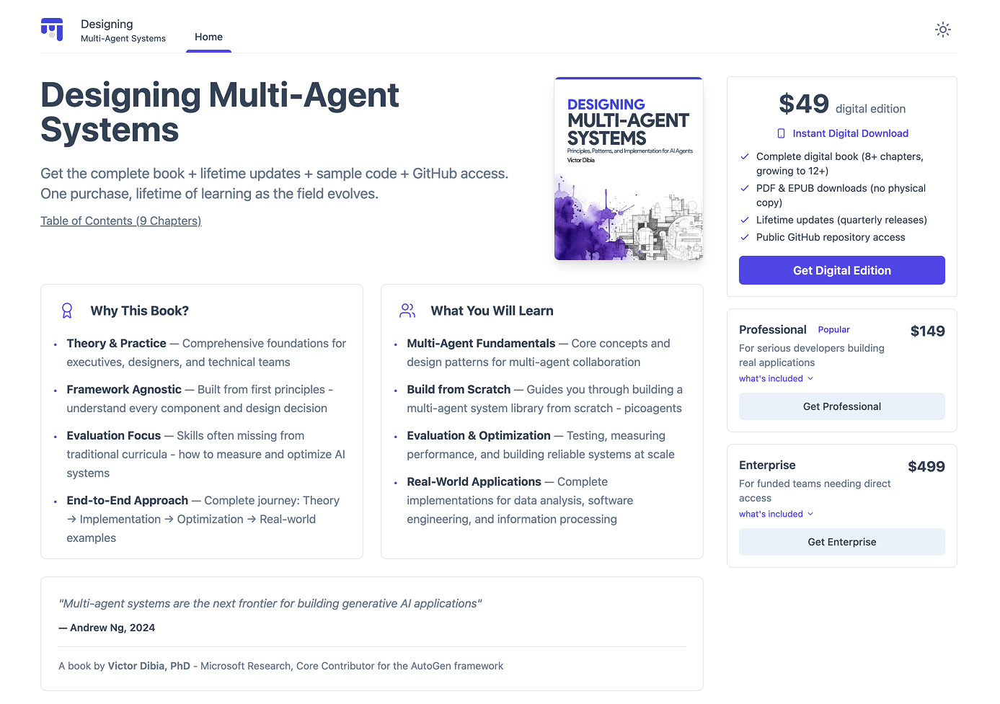

# Designing Multi-Agent Systems

Official code repository for **"Designing Multi-Agent Systems: Principles, Patterns, and Implementation for AI Agents"** by Victor Dibia.



Learn to build effective multi-agent systems from first principles (from scratch) through complete, tested implementations.

Buy the book now:

- Digital Edition - [Link](https://buy.multiagentbook.com)
- Buy Print Edition on [Amazon - Coming Soon]()

## Why This Book & Code Repository?

As the AI agent space evolves rapidly, clear patterns are emerging for building effective multi-agent systems. This book focuses on identifying these patterns and providing practical guidance for applying them effectively.

**What makes this approach unique:**

- **Fundamentals-first**: Build from scratch to understand every component and design decision
- **Complete implementations**: Every theoretical concept backed by working, tested code
- **Framework-agnostic**: Core patterns that transcend any specific framework (avoids the lock in or outdated api issue common with books that focus on a single framework)
- **Production considerations**: Evaluation, optimization, and deployment guidance from real-world experience

## What You'll Learn & Build

The book is organized across 4 parts, taking you from theory to production:

### Part I: Foundations of Multi-Agent Systems

| Chapter  | Title                                        | Code | Learning Outcome                                         |
| -------- | -------------------------------------------- | ---- | -------------------------------------------------------- |
| **Ch 1** | Understanding Multi-Agent Systems            | -    | Understand when multi-agent systems are needed           |
| **Ch 2** | Multi-Agent Patterns                         | -    | Master coordination strategies (workflows vs autonomous) |
| **Ch 3** | UX Design Principles for Multi-Agent Systems | -    | Build intuitive agent interfaces                         |

### Part II: Building Multi-Agent Systems from Scratch

| Chapter  | Title                                 | Code                                                                                                                                                                                                                                                                     | Learning Outcome                                                                          |
| -------- | ------------------------------------- | ------------------------------------------------------------------------------------------------------------------------------------------------------------------------------------------------------------------------------------------------------------------------ | ----------------------------------------------------------------------------------------- |
| **Ch 4** | Building Your First Agent             | [`agents/_agent.py`](picoagents/src/picoagents/agents/_agent.py), [`basic-agent.py`](picoagents/examples/agents/basic-agent.py), [`memory.py`](picoagents/examples/agents/memory.py), [`middleware.py`](picoagents/examples/agents/middleware.py)                        | Create production agents with tools, memory, streaming, and middleware                    |
| **Ch 5** | Computer Use Agents                   | [`agents/_computer_use/`](picoagents/src/picoagents/agents/_computer_use/), [`computer_use.py`](picoagents/examples/agents/computer_use.py)                                                                                                                              | Build browser automation agents with multimodal reasoning                                 |
| **Ch 5** | Building Multi-Agent Workflows        | [`workflow/`](picoagents/src/picoagents/workflow/), [`data_visualization/`](picoagents/examples/workflows/data_visualization/)                                                                                                                                           | Build type-safe workflows with streaming observability                                    |
| **Ch 6** | Autonomous Multi-Agent Orchestration  | [`orchestration/`](picoagents/src/picoagents/orchestration/), [`round-robin.py`](picoagents/examples/orchestration/round-robin.py), [`ai-driven.py`](picoagents/examples/orchestration/ai-driven.py), [`plan-based.py`](picoagents/examples/orchestration/plan-based.py) | Implement GroupChat, LLM-driven, and plan-based orchestration (Magentic One patterns)     |
| **Ch 6** | Building Modern Agent UX Applications | [`webui/`](picoagents/src/picoagents/webui/), CLI tools                                                                                                                                                                                                                  | Build interactive agent applications with web UI, auto-discovery, and real-time streaming |
| **Ch 6** | Multi-Agent Frameworks                | -                                                                                                                                                                                                                                                                        | Evaluate and choose the right multi-agent framework                                       |

### Part III: Evaluating and Optimizing Multi-Agent Systems

| Chapter  | Title                          | Code                                                                                                                    | Learning Outcome                                          |
| -------- | ------------------------------ | ----------------------------------------------------------------------------------------------------------------------- | --------------------------------------------------------- |
| **Ch 8** | Evaluating Multi-Agent Systems | [`eval/`](picoagents/src/picoagents/eval/), [`agent-evaluation.py`](picoagents/examples/evaluation/agent-evaluation.py) | Build evaluation frameworks with LLM-as-judge and metrics |

### Part IV: Real-World Applications

| Chapter   | Title                                     | Code                                                         | Learning Outcome                                                                         |
| --------- | ----------------------------------------- | ------------------------------------------------------------ | ---------------------------------------------------------------------------------------- |
| **Ch 13** | Business Questions from Unstructured Data | [`yc_analysis/`](picoagents/examples/workflows/yc_analysis/) | Production case study: Analyze 5,000+ companies with cost optimization and checkpointing |

## Getting Started

### Installation

```bash
# Clone the repository
git clone https://github.com/victordibia/designing-multiagent-systems.git
cd designing-multiagent-systems/picoagents

# Create virtual environment (recommended)
python -m venv venv
source venv/bin/activate  # On Windows: venv\Scripts\activate

# Basic installation
pip install -e .

# Or install with optional features
pip install -e ".[web]"           # Web UI and API server
pip install -e ".[computer-use]"  # Browser automation
pip install -e ".[examples]"      # Run example scripts
pip install -e ".[all]"           # Everything

# Set up your API key
export OPENAI_API_KEY="your-api-key-here"
```

### Quick Start: Your First Agent

In this book, we will cover the fundamentals of building multi-agent systems, and incrementally build up the `Agents` abstractions shown below:

```python
from picoagents import Agent, OpenAIChatCompletionClient

def get_weather(location: str) -> str:
    """Get current weather for a given location."""
    return f"The weather in {location} is sunny, 75°F"

# Create an agent
agent = Agent(
    name="assistant",
    instructions="You are helpful. Use tools when appropriate.",
    model_client=OpenAIChatCompletionClient(model="gpt-4o-mini"),
    tools=[get_weather]
)

# Use the agent
response = await agent.run("What's the weather in Paris?")
print(response.messages[-1].content)
```

### Launch the Web UI

```bash
# Auto-discover agents, orchestrators, and workflows in current directory
picoagents ui

# Or specify a directory
picoagents ui --dir ./examples
```

### Run Examples

```bash
# Basic agent with tools
python examples/agents/basic-agent.py

# Browser automation agent
python examples/agents/computer_use.py

# Autonomous orchestration
python examples/orchestration/round-robin.py
python examples/orchestration/ai-driven.py
```

## PicoAgents Framework

The [`picoagents/`](picoagents/) directory contains a complete multi-agent framework built from scratch to demonstrate every concept in the book:

```
picoagents/src/picoagents/
├── agents/            # Core Agent implementation (Ch 4)
│   ├── _agent.py      # Complete agent with streaming, tools, memory
│   └── _computer_use/ # Browser automation agents (Ch 5)
├── workflow/          # Type-safe workflow engine (Ch 5)
│   ├── core/          # DAG-based execution with streaming
│   └── steps/         # Reusable workflow steps
├── orchestration/     # Autonomous coordination (Ch 6)
│   ├── _round_robin.py  # Sequential turn-taking
│   ├── _ai.py           # LLM-driven speaker selection
│   └── _plan.py         # Plan-based orchestration (Magentic One)
├── tools/             # 15+ built-in tools (core, research, coding)
├── eval/              # Evaluation framework (Ch 8)
│   ├── judges/        # LLM-as-judge, reference-based
│   └── _runner.py     # Test execution and metrics
├── webui/             # Web UI with auto-discovery (Ch 6)
├── llm/               # OpenAI and Azure clients
├── memory/            # Memory implementations
├── termination/       # 9 termination conditions
└── middleware/        # Extensible middleware system

examples/
├── agents/            # Basic agents, tools, memory, computer use
├── workflows/         # Sequential, parallel, production workflows
├── orchestration/     # Round-robin, AI-driven, plan-based
└── evaluation/        # Agent evaluation patterns
```

## Key Features

🎯 **Production Patterns**

- Two-stage filtering: Reduce LLM costs by 90% (YC Analysis case study)
- Structured outputs: Eliminate hallucination with Pydantic models
- Checkpointing: Resumable workflows with state persistence
- Think tool: Structured reasoning for 54% performance improvement

🖥️ **Computer Use Agents**

- Playwright-based browser automation
- Multimodal reasoning with vision models
- Built-in tools: navigate, click, type, scroll, extract content

🌐 **Web UI & CLI**

- Auto-discovery of agents, orchestrators, workflows
- Real-time streaming with Server-Sent Events
- Session management with conversation history
- Launch: `picoagents ui`

🧪 **Evaluation Framework**

- LLM-as-judge evaluation patterns
- Reference-based validation (exact, fuzzy, contains)
- Composite scoring with multiple judges
- Comprehensive metrics collection

## Get the Book

**"Designing Multi-Agent Systems: Principles, Patterns, and Implementation for AI Agents"**

This repository implements every concept from the book. The book provides the theory, design trade-offs, and production considerations you need to build effective multi-agent systems.

- Digital Edition - [Link](https://buy.multiagentbook.com)
- Buy Print Edition on [Amazon - Coming Soon]()

## Questions and Feedback

Questions or feedback about the book or code? Please [open an issue](https://github.com/victordibia/designing-multiagent-systems/issues).

## Citation

```bibtex
@book{dibia2025multiagent,
  title={Designing Multi-Agent Systems: Principles, Patterns, and Implementation for AI Agents},
  author={Dibia, Victor},
  year={2025},
  github={https://github.com/victordibia/designing-multiagent-systems}
}
```
