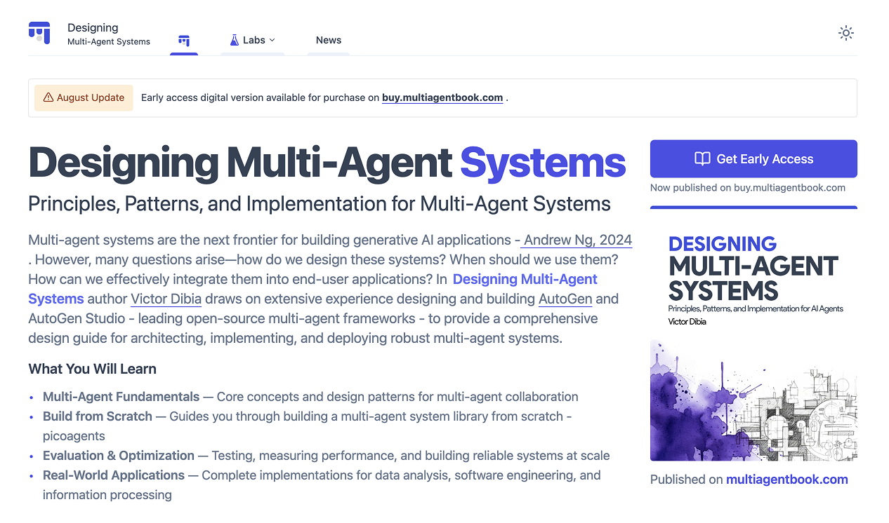
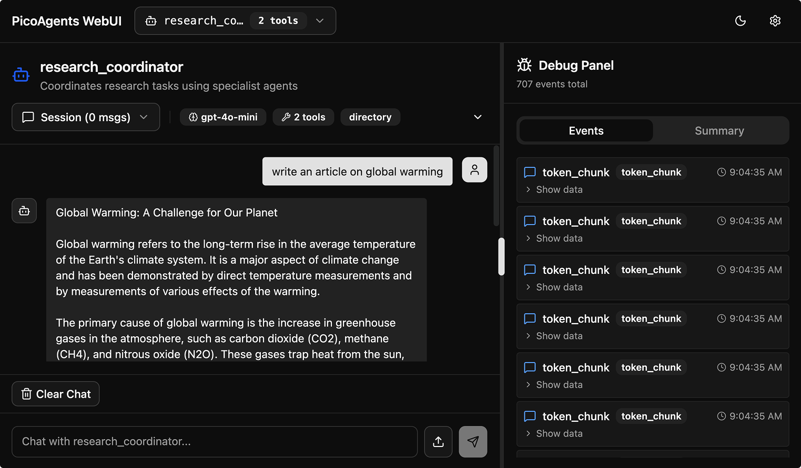

# Designing Multi-Agent Systems

Official code repository for [Designing Multi-Agent Systems: Principles, Patterns, and Implementation for AI Agents](https://buy.multiagentbook.com) by [Victor Dibia](https://victordibia.com).

[](https://codespaces.new/victordibia/designing-multiagent-systems?quickstart=1)

[](https://buy.multiagentbook.com)

Learn to build effective multi-agent systems from first principles through complete, tested implementations. This repository includes **PicoAgents**—a full-featured multi-agent framework built entirely from scratch for the sole purpose of teaching you how multi-agent systems work. Every component, from agent reasoning loops to orchestration patterns, is implemented with clarity and transparency.

[Buy Digital Edition](https://buy.multiagentbook.com) | [Buy Print - Coming Soon]()

---

## Why This Book & Code Repository?

As the AI agent space evolves rapidly, clear patterns are emerging for building effective multi-agent systems. This book focuses on identifying these patterns and providing practical guidance for applying them effectively.

**What makes this approach unique:**

- **Fundamentals-first**: Build from scratch to understand every component and design decision
- **Complete implementations**: Every theoretical concept backed by working, tested code
- **Framework-agnostic**: Core patterns that transcend any specific framework (avoids the lock in or outdated api issue common with books that focus on a single framework)
- **Production considerations**: Evaluation, optimization, and deployment guidance from real-world experience

## What You'll Learn & Build

The book is organized across 4 parts, taking you from theory to production:

### Part I: Foundations of Multi-Agent Systems

| Chapter  | Title                                        | Code                                                                              | Learning Outcome                                         |
| -------- | -------------------------------------------- | --------------------------------------------------------------------------------- | -------------------------------------------------------- |
| **Ch 1** | Understanding Multi-Agent Systems            | Poet/critic example, references [`yc_analysis/`](examples/workflows/yc_analysis/) | Understand when multi-agent systems are needed           |
| **Ch 2** | Multi-Agent Patterns                         | -                                                                                 | Master coordination strategies (workflows vs autonomous) |
| **Ch 3** | UX Design Principles for Multi-Agent Systems | -                                                                                 | Principles for building intuitive agent interfaces       |

### Part II: Building Multi-Agent Systems from Scratch

| Chapter  | Title                                 | Code                                                                                                                                                                                                                                                                                                                                                                                                                                    | Learning Outcome                                                                          |
| -------- | ------------------------------------- | --------------------------------------------------------------------------------------------------------------------------------------------------------------------------------------------------------------------------------------------------------------------------------------------------------------------------------------------------------------------------------------------------------------------------------------- | ----------------------------------------------------------------------------------------- |
| **Ch 4** | Building Your First Agent             | [`agents/_agent.py`](picoagents/src/picoagents/agents/_agent.py), [`basic-agent.py`](examples/agents/basic-agent.py), [`memory.py`](examples/agents/memory.py), [`middleware.py`](examples/agents/middleware.py) <br> [](https://colab.research.google.com/github/victordibia/designing-multiagent-systems/blob/main/examples/notebooks/01_basic_agent.ipynb) | Build agents with tools, memory, streaming, and middleware                                |
| **Ch 5** | Computer Use Agents                   | [`agents/_computer_use/`](picoagents/src/picoagents/agents/_computer_use/), [`computer_use.py`](examples/agents/computer_use.py)                                                                                                                                                                                                                                                                                                        | Build browser automation agents with multimodal reasoning                                 |
| **Ch 6** | Building Multi-Agent Workflows        | [`workflow/`](picoagents/src/picoagents/workflow/), [`workflows/`](examples/workflows/)                                                                                                                                                                                                                                                                                                                                                 | Build type-safe workflows with streaming observability                                    |
| **Ch 7** | Autonomous Multi-Agent Orchestration  | [`orchestration/`](picoagents/src/picoagents/orchestration/), [`round-robin.py`](examples/orchestration/round-robin.py), [`ai-driven.py`](examples/orchestration/ai-driven.py), [`plan-based.py`](examples/orchestration/plan-based.py)                                                                                                                                                                                                 | Implement GroupChat, LLM-driven, and plan-based orchestration (Magentic One patterns)     |
| **Ch 8** | Building Modern Agent UX Applications | [`app/`](examples/app/) (minimal FastAPI+SSE example), [`webui/`](picoagents/src/picoagents/webui/) (production React UI)                                                                                                                                                                                                                                                                                                                                                                 | Build interactive agent applications with web UI, auto-discovery, and real-time streaming |
| **Ch 9** | Multi-Agent Frameworks                | -                                                                                                                                                                                                                                                                                                                                                                                                                                       | Evaluate and choose the right multi-agent framework                                       |

### Part III: Evaluating and Optimizing Multi-Agent Systems

| Chapter   | Title                          | Code                                                                                                         | Learning Outcome                                          |
| --------- | ------------------------------ | ------------------------------------------------------------------------------------------------------------ | --------------------------------------------------------- |
| **Ch 10** | Evaluating Multi-Agent Systems | [`eval/`](picoagents/src/picoagents/eval/), [`agent-evaluation.py`](examples/evaluation/agent-evaluation.py) | Build evaluation frameworks with LLM-as-judge and metrics |

### Part IV: Real-World Applications

| Chapter   | Title                                     | Code                                              | Learning Outcome                                                                         |
| --------- | ----------------------------------------- | ------------------------------------------------- | ---------------------------------------------------------------------------------------- |
| **Ch 16** | Business Questions from Unstructured Data | [`yc_analysis/`](examples/workflows/yc_analysis/) | Production case study: Analyze 5,000+ companies with cost optimization and checkpointing |
| **Ch 17** | Software Engineering Agent                | [`swe_agent/`](examples/agents/swe_agent/)        | Build a complete software engineering agent with coding tools and workspace management   |

## Getting Started

### Option 1: Interactive Notebooks

Click Colab badges in the chapter tables above to run examples in your browser. No installation required.

### Option 2: GitHub Codespaces

<a href="https://codespaces.new/victordibia/designing-multiagent-systems?quickstart=1" target="_blank"></a>

Pre-configured development environment in your browser. Once open:

1. Add your API key: `export OPENAI_API_KEY='your-key'`
2. Run examples: `python examples/agents/basic-agent.py`
3. Launch Web UI: `picoagents ui`

Free tier: 60 hours/month

### Option 3: Local Installation

```bash
# Clone the repository
git clone https://github.com/victordibia/designing-multiagent-systems.git
cd designing-multiagent-systems

# Navigate to the PicoAgents framework directory
cd picoagents

# Create virtual environment (recommended)
python -m venv venv
source venv/bin/activate  # On Windows: venv\Scripts\activate

# Basic installation
pip install -e .

# Or install with optional features
pip install -e ".[web]"           # Web UI and API server
pip install -e ".[computer-use]"  # Browser automation
pip install -e ".[examples]"      # Run example scripts
pip install -e ".[all]"           # Everything

# Set up your API key
export OPENAI_API_KEY="your-api-key-here"
```

### Quick Start: Your First Agent

In this book, we will cover the fundamentals of building multi-agent systems, and incrementally build up the `Agents` abstractions shown below:

```python
from picoagents import Agent, OpenAIChatCompletionClient

def get_weather(location: str) -> str:
    """Get current weather for a given location."""
    return f"The weather in {location} is sunny, 75°F"

# Create an agent
agent = Agent(
    name="assistant",
    instructions="You are helpful. Use tools when appropriate.",
    model_client=OpenAIChatCompletionClient(model="gpt-4.1-mini"),
    tools=[get_weather]
)

# Use the agent
response = await agent.run("What's the weather in Paris?")
print(response.messages[-1].content)
```

### Model Client Setup

PicoAgents supports multiple LLM providers through a unified interface. Each provider requires minimal setup—just API credentials and switching the client class. Chapter 4 covers building custom model clients for any provider.

| Provider | Client Class | Setup | Example | Source |
|----------|-------------|-------|---------|--------|
| **OpenAI** | [`OpenAIChatCompletionClient`](picoagents/src/picoagents/llm/_openai.py) | 1. Get API key from [platform.openai.com](https://platform.openai.com)<br>2. `export OPENAI_API_KEY='sk-...'` | [`basic-agent.py`](examples/agents/basic-agent.py) | [`_openai.py`](picoagents/src/picoagents/llm/_openai.py) |
| **Azure OpenAI** | [`AzureOpenAIChatCompletionClient`](picoagents/src/picoagents/llm/_azure_openai.py) | 1. Deploy model on [Azure Portal](https://portal.azure.com)<br>2. Set endpoint, key, deployment name | [`agent_azure.py`](examples/agents/agent_azure.py) | [`_azure_openai.py`](picoagents/src/picoagents/llm/_azure_openai.py) |
| **Anthropic** | [`AnthropicChatCompletionClient`](picoagents/src/picoagents/llm/_anthropic.py) | 1. Get API key from [console.anthropic.com](https://console.anthropic.com)<br>2. `export ANTHROPIC_API_KEY='sk-...'` | [`agent_anthropic.py`](examples/agents/agent_anthropic.py) | [`_anthropic.py`](picoagents/src/picoagents/llm/_anthropic.py) |
| **GitHub Models** | [`OpenAIChatCompletionClient`](picoagents/src/picoagents/llm/_openai.py)<br>+ `base_url` | 1. Get token from [github.com/settings/tokens](https://github.com/settings/tokens)<br>2. `export GITHUB_TOKEN='ghp_...'`<br>3. Set `base_url="https://models.github.ai/inference"` | [`agent_githubmodels.py`](examples/agents/agent_githubmodels.py) | Uses [`_openai.py`](picoagents/src/picoagents/llm/_openai.py) |
| **Local/Custom** | [`OpenAIChatCompletionClient`](picoagents/src/picoagents/llm/_openai.py)<br>+ `base_url` | Point to any OpenAI-compatible endpoint<br>(Ollama, LM Studio, vLLM, etc.) | Use `base_url="http://localhost:8000"` | Uses [`_openai.py`](picoagents/src/picoagents/llm/_openai.py) |

**Quick Examples:**

```python
# OpenAI (default)
from picoagents import OpenAIChatCompletionClient
client = OpenAIChatCompletionClient(model="gpt-4.1-mini")

# Anthropic
from picoagents import AnthropicChatCompletionClient
client = AnthropicChatCompletionClient(model="claude-3-5-sonnet-20241022")

# GitHub Models (free tier)
client = OpenAIChatCompletionClient(
    model="openai/gpt-4.1-mini",
    api_key=os.getenv("GITHUB_TOKEN"),
    base_url="https://models.github.ai/inference"
)

# Local LLM (e.g., Ollama)
client = OpenAIChatCompletionClient(
    model="llama3.2",
    base_url="http://localhost:11434/v1"
)
```

### Launch the Web UI



```bash
# Auto-discover agents, orchestrators, and workflows in current directory
picoagents ui

# Or specify a directory
picoagents ui --dir ./examples
```

The Web UI provides streaming chat, real-time debug events, session management, and automatic discovery of all agents and workflows in your codebase.

### Run Examples

Examples are now at the root level for easy access:

```bash
# Basic agent with tools (Chapter 4)
python examples/agents/basic-agent.py

# Browser automation agent (Chapter 5)
python examples/agents/computer_use.py

# Autonomous orchestration (Chapter 6)
python examples/orchestration/round-robin.py
python examples/orchestration/ai-driven.py

# Production workflow (Chapter 13)
python examples/workflows/yc_analysis/workflow.py
```

## PicoAgents Framework

This repository is organized into two main components:

### 1. Framework Source ([`picoagents/`](picoagents/))

Complete multi-agent framework built from scratch:

```
picoagents/
├── src/picoagents/
│   ├── agents/            # Core Agent implementation (Ch 4)
│   │   ├── _agent.py      # Complete agent with streaming, tools, memory
│   │   └── _computer_use/ # Browser automation agents (Ch 5)
│   ├── workflow/          # Type-safe workflow engine (Ch 5)
│   │   ├── core/          # DAG-based execution with streaming
│   │   └── steps/         # Reusable workflow steps
│   ├── orchestration/     # Autonomous coordination (Ch 6)
│   │   ├── _round_robin.py  # Sequential turn-taking
│   │   ├── _ai.py           # LLM-driven speaker selection
│   │   └── _plan.py         # Plan-based orchestration (Magentic One)
│   ├── tools/             # 15+ built-in tools (core, research, coding)
│   ├── eval/              # Evaluation framework (Ch 8)
│   │   ├── judges/        # LLM-as-judge, reference-based
│   │   └── _runner.py     # Test execution and metrics
│   ├── webui/             # Web UI with auto-discovery (Ch 6)
│   ├── llm/               # OpenAI and Azure clients
│   ├── memory/            # Memory implementations
│   ├── termination/       # 9 termination conditions
│   └── middleware/        # Extensible middleware system
└── tests/                 # Comprehensive test suite

### 2. Examples ([`examples/`](examples/))
50+ runnable examples organized by chapter:

examples/
├── agents/            # Ch 4: Basic agents, tools, memory, computer use
├── workflows/         # Ch 5: Sequential, parallel, production workflows
├── orchestration/     # Ch 6: Round-robin, AI-driven, plan-based
└── evaluation/        # Ch 8: Agent evaluation patterns
```

## Key Features

**Production-Ready Patterns**

Illustrated through real-world case studies (see [YC Analysis workflow](examples/workflows/yc_analysis/)):

- Cost optimization: Two-stage filtering for 90% LLM cost reduction
- Type safety: Structured outputs with Pydantic validation
- Reliability: Checkpointing and resumable workflows
- Advanced reasoning: Think tool for improved problem-solving (54% performance gain)

**Computer Use Agents**

- Playwright-based browser automation
- Multimodal reasoning with vision models
- Built-in tools: navigate, click, type, scroll, extract content

**Web UI & CLI**

- Auto-discovery of agents, orchestrators, workflows
- Real-time streaming with Server-Sent Events
- Session management with conversation history
- Launch: `picoagents ui`

**Evaluation Framework**

- LLM-as-judge evaluation patterns
- Reference-based validation (exact, fuzzy, contains)
- Composite scoring with multiple judges
- Comprehensive metrics collection

## Get the Book

**"Designing Multi-Agent Systems: Principles, Patterns, and Implementation for AI Agents"**

This repository implements every concept from the book. The book provides the theory, design trade-offs, and production considerations you need to build effective multi-agent systems.

- [Buy Digital Edition](https://buy.multiagentbook.com)
- Buy Print Edition on Amazon - Coming Soon

## Questions and Feedback

Questions or feedback about the book or code? Please [open an issue](https://github.com/victordibia/designing-multiagent-systems/issues).

## Citation

```bibtex
@book{dibia2025multiagent,
  title={Designing Multi-Agent Systems: Principles, Patterns, and Implementation for AI Agents},
  author={Dibia, Victor},
  year={2025},
  github={https://github.com/victordibia/designing-multiagent-systems}
}
```
