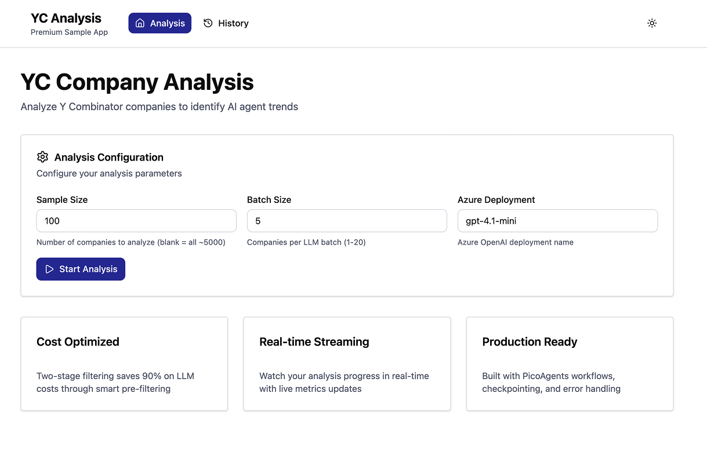

# Premium Code Samples

Production-ready, end-to-end applications demonstrating advanced multi-agent patterns from "Designing Multi-Agent Systems".

## What Are Premium Samples?

These are **complete, deployable applications** that showcase real-world multi-agent systems. Unlike simple code snippets, each sample includes:

- Full-stack implementation (backend + frontend)
- Production-ready architecture
- Docker deployment configuration
- Comprehensive documentation
- Cost optimization strategies
- Professional UI/UX
- Real-time progress monitoring

## Access

Premium samples are **exclusively available** to Professional tier book bundle purchasers.

**[Purchase Professional Bundle →](https://buy.multiagentbook.com)**

Already purchased? **[Access your samples in the dashboard →](https://buy.multiagentbook.com/dashboard)**

---

## Available Samples

### YC Analysis App



**Analyze thousands of Y Combinator companies to identify AI agent trends**

A production application demonstrating how to build cost-effective multi-agent workflows for analyzing large datasets. Features a 4-stage workflow with intelligent filtering that achieves 90% cost reduction.

**What You'll Learn:**
- Multi-stage workflow orchestration
- Cost optimization through two-stage filtering
- Real-time streaming with Server-Sent Events
- Event-driven architecture patterns
- Production deployment with Docker

**Tech Stack:**
- Backend: FastAPI, PicoAgents, Python 3.11+
- Frontend: React 19, TypeScript, Vite, Tailwind CSS v4
- Deployment: Docker, Docker Compose

**Key Features:**
- 4-stage workflow: Load → Filter → Classify → Analyze
- Real-time progress streaming
- Interactive results dashboard
- Historical runs gallery
- Checkpointing and resume
- 5-minute setup time

**Cost Estimates:**
- 100 companies: ~$0.30
- 500 companies: ~$1.50
- Full dataset (5,622): ~$15.00

**Related Chapters:** 5 (Workflows), 6 (Orchestration), 13 (Case Studies)

[📂 View Full README](./yc-analysis-app/) • [📚 Documentation](https://github.com/victordibia/designing-multiagent-systems/blob/main/premium-samples/yc-analysis-app/README.md)

---

## Coming Soon

More premium samples are in development:

- **Data Visualization Agent** - AI-powered chart generation from CSV files
- **Multi-Agent Research Assistant** - Coordinated agents for literature review
- **Code Review Workflow** - Automated code analysis and improvement suggestions

---

## How to Use

### 1. Purchase Access
Premium samples are included with the Professional tier book bundle ($149).

[Purchase Now →](https://buy.multiagentbook.com)

### 2. Download
Access your purchased samples from the customer dashboard:

[Dashboard →](https://buy.multiagentbook.com/dashboard)

### 3. Run
Each sample includes a quick-start guide for Docker deployment:

```bash
# Extract the zip
unzip yc-analysis-app.zip
cd yc-analysis-app/

# Configure API keys
cp .env.example backend/.env
# Edit backend/.env with your API credentials

# Start with Docker
docker-compose up --build

# Access at http://localhost:8000
```

---

## Support

- **Documentation**: Each sample includes comprehensive README and QUICK_START guides
- **Email Support**: support@multiagentbook.com
- **Dashboard**: https://buy.multiagentbook.com/dashboard

---

## License

Premium samples are licensed under MIT for commercial use by Professional and Enterprise tier buyers. See individual sample LICENSE files for details.

---

## Metadata API

For programmatic access to sample information, use:

```
https://raw.githubusercontent.com/victordibia/designing-multiagent-systems/main/premium-samples/samples.json
```

This JSON file contains structured metadata for all available samples, including titles, descriptions, tech stacks, features, and download information.
